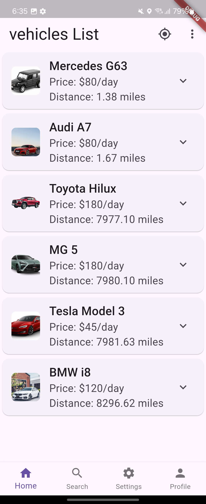
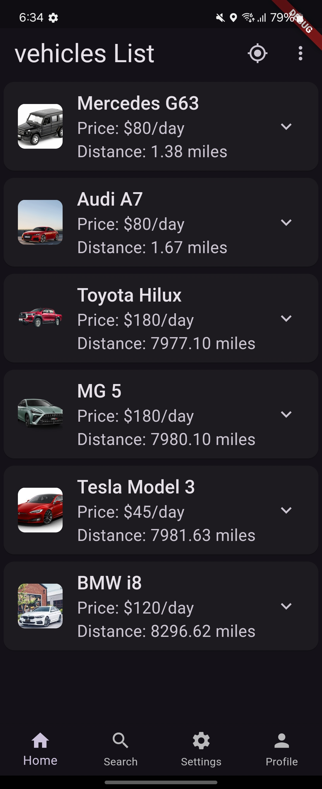
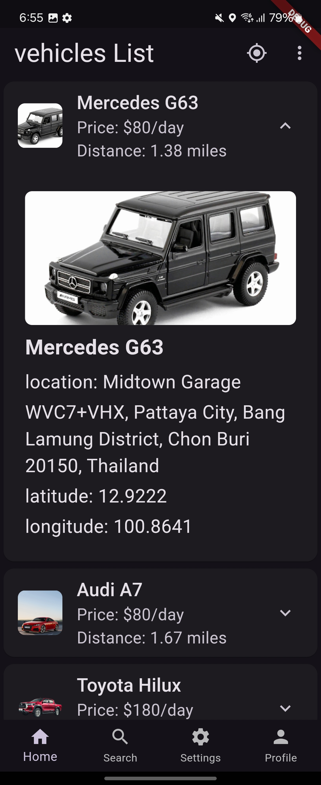
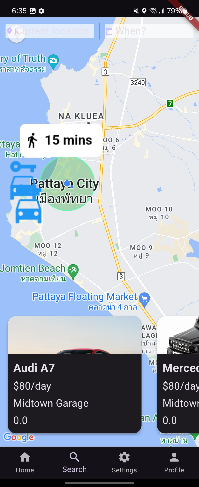
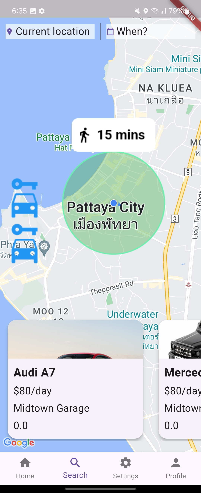
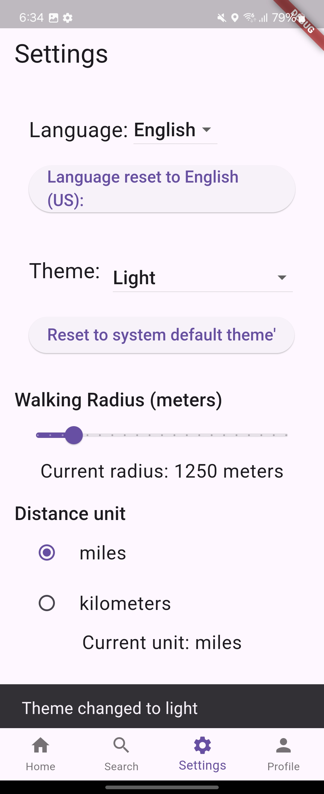

# Ezcars
## Table of contents

# Ezcars - P2P Car Rental Mockup

**Ezcars** is a peer-to-peer (P2P) car rental mockup application built using Flutter. This app integrates with the **Google Maps API** to allow users to browse and manage rental vehicles, displaying car locations on an interactive map. Users can navigate through multiple screens to view car details, manage their profile, adjust settings, and search for available rental cars.

## Table of Contents
- [Ezcars](#ezcars)
  - [Table of contents](#table-of-contents)
- [Ezcars - P2P Car Rental Mockup](#ezcars---p2p-car-rental-mockup)
  - [Table of Contents](#table-of-contents-1)
  - [Features](#features)
  - [1. Home Screen](#1-home-screen)
  - [2. Search Screen](#2-search-screen)
  - [3. Profile Screen](#3-profile-screen)
  - [4. Settings Screen](#4-settings-screen)
  - [5. Google Maps Integration](#5-google-maps-integration)
  - [6. API Key Management](#6-api-key-management)
  - [7. Main Navigation](#7-main-navigation)
  - [8. Localization (l10n)](#8-localization-l10n)
  - [Technical Overview](#technical-overview)
  - [Getting Started](#getting-started)
    - [1. Clone the Repository](#1-clone-the-repository)
    - [2. Navigate to the Project Directory](#2-navigate-to-the-project-directory)
    - [3. Install Dependencies](#3-install-dependencies)
    - [4. Set Up Google Maps API Keys](#4-set-up-google-maps-api-keys)
      - [Steps to Set Up API Keys:](#steps-to-set-up-api-keys)
    - [5. Enable Required Permissions](#5-enable-required-permissions)
      - [Android:](#android)
    - [iOS](#ios)
      - [1. Add Location Permissions:](#1-add-location-permissions)
      - [2. Add Google Maps API Key:](#2-add-google-maps-api-key)
    - [6. Run the App](#6-run-the-app)
      - [To run the app, use the following command:](#to-run-the-app-use-the-following-command)
    - [7. Optional: Running on Specific Platforms](#7-optional-running-on-specific-platforms)
      - [Running on Android:](#running-on-android)
      - [Running on iOS:](#running-on-ios)
    - [8. Optional: Localization (l10n) Support](#8-optional-localization-l10n-support)
  - [Technologies](#technologies)
  - [Authors](#authors)
  - [Screenshots](#screenshots)

## Features

## 1. Home Screen
The Home Screen provides users with an overview of the app, acting as the main entry point for navigation.

- Displays essential app content, including quick access to the search and profile sections.
- Central hub for navigating to other screens, including Search, Profile, and Settings.

## 2. Search Screen
The Search Screen allows users to search for available rental cars. Search results are displayed based on user input, showing key details such as the car’s location and availability.

- Search functionality with text input.
- Displays a list of available rental cars based on filters and user input.

## 3. Profile Screen
The Profile Screen allows users to view and update their personal information, such as username, email, and profile picture.

- View and manage personal profile information.
- Access past and current car rentals.

## 4. Settings Screen
The Settings Screen allows users to customize the app's behavior and appearance according to their preferences.

- Manage notification settings, theme (dark mode/light mode), and privacy controls.
- Provides an interface to manage account-related configurations.

## 5. Google Maps Integration
The app integrates with **Google Maps API** to display rental car locations on an interactive map. Users can view and interact with car markers to see more details.

- Real-time map with zoom, pan, and marker functionalities.
- Each marker shows details such as the car’s location, price, and availability.
- Users can tap on the marker to see more details about the car and rental information.

## 6. API Key Management
To interact with Google Maps, the app uses API keys that are securely stored in the `keys.dart` file located in the `lib` folder.

Here’s an example of how the API keys are managed:

```dart
class APIKeys {
   static String androidPlacesApiKey = "YOUR DROID KEY HERE";
   static String iosApiKey = "YOUR IOS KEY HERE";
}
```
Ensure you replace the placeholders with your actual Google Maps API keys before running the app.

## 7. Main Navigation

The app features a BottomNavigationBar for seamless navigation between the Home, Search, Profile, and Settings screens.

- Persistent navigation using BottomNavigationBar.
- Uses an IndexedStack to maintain the state of screens when switching between tabs.

## 8. Localization (l10n)

The app is fully localized (l10n), supporting multiple languages. It uses the AppLocalizations class to provide a seamless experience for users from different regions.

- Support for multiple languages.
- Localized strings for UI elements like navigation bar labels and screen titles.
- Language fallback mechanism for unsupported locales.

## Technical Overview

## Getting Started

## Getting Started

To get started with the app locally, follow these steps:

### 1. Clone the Repository
First, clone the repository to your local machine using Git:
```bash
git clone https://github.com/username/MyApp.git
```

### 2. Navigate to the Project Directory
Once the repository is cloned, navigate into the project directory where the app files are located. Use the following command:

```bash
cd MyApp
```

### 3. Install Dependencies
After navigating to the project directory, you need to install all the required dependencies that the app relies on. This can be done using Flutter's package manager.

Run the following command in the terminal:

```bash
flutter pub get
```

### 4. Set Up Google Maps API Keys
To enable Google Maps functionality within the app, you need to configure the API keys for both Android and iOS platforms.

#### Steps to Set Up API Keys:

1. Open the `lib/keys.dart` file in the project directory.
2. Replace the placeholder values for the API keys (`YOUR DROID KEY HERE` and `YOUR IOS KEY HERE`) with your actual Google Maps API keys.

Example of the `keys.dart` file:

```dart
class APIKeys {
   static String androidPlacesApiKey = "YOUR DROID KEY HERE";
   static String iosApiKey = "YOUR IOS KEY HERE";
}
```

### 5. Enable Required Permissions
To use location services and display Google Maps, you must configure the appropriate permissions for both Android and iOS platforms.

#### Android:
#### 1. Open the `android/app/src/main/AndroidManifest.xml` file.
#### 2. Add the following permissions inside the `<manifest>` tag to enable location access:

```xml
<uses-permission android:name="android.permission.ACCESS_FINE_LOCATION" />
<uses-permission android:name="android.permission.ACCESS_COARSE_LOCATION" />
<uses-feature android:name="android.hardware.location.gps" />
```

#### iOS

To use location services and display Google Maps on iOS, you need to configure certain permissions and set up the Google Maps API key.

#### 1. Add Location Permissions:
Open the `ios/Runner/Info.plist` file and add the following key-value pairs to request location permissions from the user:

```xml
<key>NSLocationWhenInUseUsageDescription</key>
<string>This app needs access to your location to show rental cars near you.</string>

<key>NSLocationAlwaysUsageDescription</key>
<string>Your location will be used to provide nearby car rentals.</string>
```

#### 2. Add Google Maps API Key:
To use Google Maps on iOS, you need to provide your API key. Open the ios/Runner/AppDelegate.swift file and locate the didFinishLaunchingWithOptions method. Inside this method, add the following line:
```
GMSServices.provideAPIKey("YOUR_IOS_API_KEY")
```

Replace YOUR_IOS_API_KEY with the actual Google Maps API key that you obtained from the Google Cloud Console.

### 6. Run the App

Once you have set up the API keys and configured the necessary permissions for both Android and iOS, you can now run the app locally on your development machine.

#### To run the app, use the following command:

```bash
flutter run
```

### 7. Optional: Running on Specific Platforms

If you want to run the app on a specific platform (either Android or iOS), follow these additional steps.

#### Running on Android:
To run the app on an Android device or emulator, use the following command:
```bash
flutter run -d android
```

#### Running on iOS:
To run the app on an iOS device or emulator, use the following command:
```bash
flutter run -d ios
```
### 8. Optional: Localization (l10n) Support
The app supports localization (l10n). To add or modify translations:

- Edit the localization files located in the lib/l10n/ folder.
- Ensure new translations are added in the AppLocalizations class.
- Run the following command to generate localization code:

```
flutter pub run intl_utils:generate
```

## Technologies

<table style="border: none">
<tr style="border: none">
  <td style="border: none">Flutter</td><td style="border: none">
  </td>
</tr>
<tr style="border: none">
  <td style="border: none">Dart</td><td style="border: none">
  </td>
</tr>
<tr style="border: none">
  <td style="border: none">Android</td><td style="border: none">
  </td>
</tr>
<tr style="border: none">
  <td style="border: none">Apple iOS</td><td style="border: none">
  </td>
</tr>

</table>


## Authors

POP's Code Lab

## Screenshots








---


---
